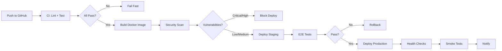

# WeMarket Architecture Documentation

## Overview

WeMarket is a **SaaS QR Menu & Small Business Platform** built as a Vite-based React SPA with a Node.js/Express backend, PostgreSQL database, and Redis caching layer. The platform provides QR-based digital menus, ordering, payments, waitlist management, and AI-powered recommendations.

---

## System Architecture

```
┌─────────────────────────────────────────────────────────────────────────────┐
│                            EXTERNAL CLIENTS                                   │
│  ┌──────────────┐  ┌──────────────┐  ┌──────────────┐  ┌──────────────┐    │
│  │  Customer    │  │  Merchant    │  │  Admin       │  │  3rd Party   │    │
│  │  (Mobile)    │  │  (Dashboard) │  │  (Master)    │  │  (Toss/FB)   │    │
│  └──────┬───────┘  └──────┬───────┘  └──────┬───────┘  └──────┬───────┘    │
└─────────┼─────────────────┼─────────────────┼─────────────────┼────────────┘
          │                 │                 │                 │
          ▼                 ▼                 ▼                 ▼
┌─────────────────────────────────────────────────────────────────────────────┐
│                          API GATEWAY / LOAD BALANCER                          │
│                         (Cloudflare / Nginx)                                  │
└────────────────────────────────────┬──────────────────────────────────────────┘
                                     │
                                     ▼
┌─────────────────────────────────────────────────────────────────────────────┐
│                         WE-MARKET API SERVER (Node.js/Express)                │
│  ┌────────────────────────────────────────────────────────────────────────┐  │
│  │                        MIDDLEWARE LAYER                                  │  │
│  │  ┌──────────┐ ┌──────────┐ ┌──────────┐ ┌──────────┐ ┌──────────┐      │  │
│  │  │ Auth     │ │ Rate     │ │ Circuit  │ │ Request  │ │ Error    │      │  │
│  │  │ (JWT)    │ │ Limit    │ │ Breaker  │ │ Tracking │ │ Handler  │      │  │
│  │  └──────────┘ └──────────┘ └──────────┘ └──────────┘ └──────────┘      │  │
│  └────────────────────────────────────────────────────────────────────────┘  │
│                                     │                                         │
│  ┌──────────────────────────────────┼──────────────────────────────────────┐  │
│  │          ROUTE MODULES (Feature-based)                                 │  │
│  │  ┌─────────┐ ┌─────────┐ ┌─────────┐ ┌─────────┐ ┌─────────┐           │  │
│  │  │ Auth    │ │ Store   │ │ Order   │ │ AI/ML   │ │ Payment │  ...    │  │
│  │  │ Routes  │ │ Routes  │ │ Routes  │ │ Routes  │ │ Routes  │           │  │
│  │  └─────────┘ └─────────┘ └─────────┘ └─────────┘ └─────────┘           │  │
│  └──────────────────────────────────┼──────────────────────────────────────┘  │
│                                     │                                         │
│  ┌──────────────────────────────────┼──────────────────────────────────────┐  │
│  │           CONTROLLER LAYER                                              │  │
│  │  (Request validation, orchestration, response formatting)              │  │
│  └──────────────────────────────────┼──────────────────────────────────────┘  │
│                                     │                                         │
│  ┌──────────────────────────────────┼──────────────────────────────────────┐  │
│  │           SERVICE LAYER (Business Logic)                                │  │
│  │  ┌──────────────┐ ┌──────────────┐ ┌──────────────┐ ┌──────────────┐    │  │
│  │  │ aiService    │ │ OrderService │ │ TossPayment  │ │ SMS/FCM      │    │  │
│  │  │ (OmniRoute)  │ │              │ │ Service      │ │ Service      │    │  │
│  │  └──────────────┘ └──────────────┘ └──────────────┘ └──────────────┘    │  │
│  └──────────────────────────────────┼──────────────────────────────────────┘  │
│                                     │                                         │
│  ┌──────────────────────────────────┼──────────────────────────────────────┐  │
│  │           REPOSITORY LAYER (Data Access)                                │  │
│  │  ┌──────────────┐ ┌──────────────┐ ┌──────────────┐ ┌──────────────┐    │  │
│  │  │ ProductRepo  │ │ OrderRepo    │ │ StoreRepo    │ │ UserRepo     │    │  │
│  │  └──────────────┘ └──────────────┘ └──────────────┘ └──────────────┘    │  │
│  └──────────────────────────────────┼──────────────────────────────────────┘  │
└────────────────────────────────────┼──────────────────────────────────────────┘
                                     │
         ┌───────────────────────────┼───────────────────────────┐
         ▼                           ▼                           ▼
┌──────────────────┐      ┌──────────────────┐      ┌──────────────────┐
│   PostgreSQL     │      │     Redis        │      │  External APIs   │
│   (Supabase)     │      │   (Cache/Queue)  │      │  (Toss, Firebase,│
│  - Primary DB    │      │  - Session       │      │   OmniRoute,     │
│  - Prisma ORM    │      │  - Rate Limit    │      │   Naver, SMS)    │
│  - Migrations    │      │  - Pub/Sub       │      │                  │
└──────────────────┘      └──────────────────┘      └──────────────────┘
```

---

## Technology Stack

### Backend
| Layer | Technology | Version | Purpose |
|-------|------------|---------|---------|
| Runtime | Node.js | 22.x (LTS) | JavaScript runtime |
| Framework | Express.js | 4.x | Web framework |
| Database ORM | Prisma | 5.x | Type-safe database access |
| Database | PostgreSQL | 16 | Primary data store (Supabase) |
| Cache | Redis | 7.x | Sessions, rate limiting, queues |
| Auth | JWT | - | Stateless authentication |
| Validation | express-validator | - | Request validation |
| Logging | Winston | 3.x | Structured logging |
| AI/ML | OmniRoute (OpenAI-compatible) | - | Multi-model AI gateway |

### Frontend
| Layer | Technology | Version | Purpose |
|-------|------------|---------|---------|
| Framework | React | 18.x | UI library |
| Build Tool | Vite | 5.x | Fast build/dev server |
| Router | React Router | 6.x | Client-side routing |
| State | Zustand | 4.x | Lightweight state management |
| Data Fetching | TanStack Query | 5.x | Server state management |
| Styling | Tailwind CSS | 3.x | Utility-first CSS |
| i18n | react-i18next | 14.x | Internationalization |
| Animations | Framer Motion | 11.x | Declarative animations |

### DevOps & Infrastructure
| Category | Technology | Purpose |
|----------|------------|---------|
| Container | Docker / Docker Compose | Containerization |
| CI/CD | GitHub Actions | Automated pipelines |
| Orchestration | Kubernetes (Helm/ArgoCD) | Production orchestration |
| Monitoring | Prometheus + Grafana | Metrics & alerting |
| Logging | Loki + Promtail | Log aggregation |
| Tracing | (Planned) Jaeger | Distributed tracing |
| IaC | Render.yaml / Helm | Infrastructure as Code |
| Security | Trivy, Semgrep, Snyk | Vulnerability scanning |

---

## Data Architecture

### Database Schema (Key Models)

```
┌─────────────┐       ┌─────────────┐       ┌─────────────┐
│    Store    │◄──────│   Product   │──────►│  Category   │
├─────────────┤       ├─────────────┤       ├─────────────┤
│ id          │       │ id          │       │ id          │
│ name        │       │ storeId     │       │ storeId     │
│ ownerId     │       │ name        │       │ name        │
│ settings    │       │ price       │       │ displayOrder│
│ createdAt   │       │ isActive    │       │ createdAt   │
└─────────────┘       │ imageUrl    │       └─────────────┘
                      └──────┬──────┘
                             │
              ┌──────────────┼──────────────┐
              ▼              ▼              ▼
         ┌─────────┐  ┌─────────────┐ ┌──────────┐
         │ Option  │  │ Nutrition   │ │  Image   │
         │ Template│  │ Info        │ │  Asset   │
         └─────────┘  └─────────────┘ └──────────┘

┌─────────────┐       ┌─────────────┐       ┌─────────────┐
│    Order    │◄──────│  OrderItem  │──────►│  Payment    │
├─────────────┤       ├─────────────┤       ├─────────────┤
│ id          │       │ id          │       │ id          │
│ storeId     │       │ orderId     │       │ orderId     │
│ customerId  │       │ productId   │       │ tossPaymentId│
│ status      │       │ quantity    │       │ amount      │
│ totalAmount │       │ unitPrice   │       │ status      │
│ createdAt   │       │ options     │       │ createdAt   │
└─────────────┘       └─────────────┘       └─────────────┘

┌─────────────┐       ┌─────────────┐       ┌─────────────┐
│   User      │◄──────│  Customer   │──────►│   Review    │
├─────────────┤       ├─────────────┤       ├─────────────┤
│ id          │       │ id          │       │ id          │
│ email       │       │ userId      │       │ storeId     │
│ phoneHash   │       │ name        │       │ orderId     │
│ role        │       │ phone       │       │ rating      │
│ createdAt   │       │ point       │       │ content     │
└─────────────┘       └─────────────┘       └─────────────┘
```

### Redis Data Structures

| Key Pattern | Type | TTL | Purpose |
|-------------|------|-----|---------|
| `session:{id}` | String | 24h | JWT refresh tokens |
| `ratelimit:{ip}:{endpoint}` | String | 60s | Rate limiting counters |
| `cache:products:{storeId}` | String | 300s | Popular products cache |
| `cache:analytics:{storeId}:{date}` | String | 3600s | Analytics aggregation cache |
| `queue:orders` | List | - | Order processing queue |
| `queue:notifications` | List | - | Push/SMS notification queue |
| `lock:{resource}` | String | 30s | Distributed locking |
| `pubsub:order_events` | Pub/Sub | - | Real-time order updates |

---

## API Design

### REST Conventions

| Aspect | Convention |
|--------|------------|
| Base Path | `/api/v1` |
| Resources | Plural nouns (`/stores`, `/orders`) |
| IDs | UUID v4 or numeric (consistent per resource) |
| Filtering | Query params (`?status=active&category=beverage`) |
| Pagination | `page`, `limit` with `total`, `hasNext` in response |
| Sorting | `sortBy`, `sortOrder` |
| Errors | RFC 7807 Problem Details format |

### Response Envelope

```json
{
  "success": true,
  "data": { ... },
  "meta": {
    "page": 1,
    "limit": 20,
    "total": 100,
    "hasNext": true
  },
  "requestId": "uuid"
}
```

### Error Response (RFC 7807)

```json
{
  "type": "https://api.wemarket.com/errors/validation-error",
  "title": "Validation Failed",
  "status": 400,
  "detail": "Request body validation failed",
  "instance": "/api/v1/orders",
  "errors": [
    { "field": "storeId", "message: "Required" }
  ]
}
```

---

## AI/ML Architecture

### OmniRoute Integration

```
┌─────────────────────────────────────────────────────────────────┐
│                      AI SERVICE LAYER                            │
│  ┌───────────────────────────────────────────────────────────┐  │
│  │                    generateWithFallback()                    │  │
│  │  ┌──────────────┐      ┌──────────────┐                    │  │
│  │  │   Gemini     │ ───► │  OmniRoute   │  (fallback chain)  │  │
│  │  │  (Primary)   │      │ (gpt-4o-mini)│                    │  │
│  │  └──────────────┘      └──────────────┘                    │  │
│  └───────────────────────────────────────────────────────────┘  │
│                              │                                   │
│                              ▼                                   │
│  ┌───────────────────────────────────────────────────────────┐  │
│  │                   Caching Layer (Redis)                     │  │
│  │  • TTL: 5min for recommendations, 1hr for translations    │  │
│  │  • Key: hash(prompt + params + model)                      │  │
│  └───────────────────────────────────────────────────────────┘  │
│                              │                                   │
│                              ▼                                   │
│  ┌───────────────────────────────────────────────────────────┐  │
│  │                   Usage Tracking                             │  │
│  │  • Tokens (prompt/completion/total)                         │  │
│  │  • Cost estimation (USD)                                    │  │
│  │  • Latency (ms)                                             │  │
│  │  • Provider (gemini/omniroute)                              │  │
│  │  • Cache hit/miss                                           │  │
│  │  • Fallback used                                            │  │
│  └───────────────────────────────────────────────────────────┘  │
└─────────────────────────────────────────────────────────────────┘
```

### AI Capabilities

| Endpoint | Purpose | Model | Cache TTL |
|----------|---------|-------|-----------|
| `POST /api/ai/describe-menu` | Generate menu descriptions | Gemini 2.0 Flash | 1hr |
| `POST /api/ai/instagram` | Instagram copy generation | Gemini 2.0 Flash | 1hr |
| `POST /api/ai/recommend` | Personalized menu recommendations | OmniRoute | 5min |
| `POST /api/ai/translate-menu` | Batch menu translation | OmniRoute | 1hr |
| `POST /api/ai/scan-menu-image` | OCR + menu parsing | Gemini 1.5 Flash | - |
| `POST /api/ai/tinkerbell-rec` | Real-time AI assistant | OmniRoute | 5min |
| `GET /api/waiting/store/:id/ai-suggestions` | Waitlist suggestions | OmniRoute | 5min |

---

## Security Architecture

### Authentication Flow

```
┌─────────┐     ┌──────────────┐     ┌─────────────┐     ┌────────────┐
│ Client  │────►│  /auth/login │────►│  Validate   │────►│ Issue JWT  │
│         │     │              │     │  Credentials│     │  + Refresh │
└─────────┘     └──────────────┘     └─────────────┘     └────────────┘
      │                                                       │
      │                    ┌──────────────┐                   │
      └───────────────────►│  /auth/refresh                │
                           │  (Refresh Token Rotation)     │
                           └───────────────────────────────┘
```

### Security Layers

| Layer | Implementation |
|-------|----------------|
| Transport | TLS 1.3 (Cloudflare) |
| API Auth | JWT (RS256) with short expiry (15min access, 7d refresh) |
| Rate Limiting | Per-IP + per-user (express-rate-limit + Redis) |
| Input Validation | express-validator + Prisma schema constraints |
| SQL Injection | Prisma parameterized queries |
| XSS Prevention | Helmet.js CSP, React auto-escaping |
| CORS | Strict origin allowlist |
| Secrets | Render/GitHub Secrets (never in code) |
| Vulnerability Scanning | Trivy (container), Semgrep (code), npm audit |
| Dependency Updates | Dependabot + Renovate |

---

## Deployment Architecture

### Environments

| Environment | Purpose | Infrastructure | Auto-deploy |
|-------------|---------|----------------|-------------|
| Development | Local dev | Docker Compose | - |
| Staging | Integration testing | Render (free tier) | On push to `develop` |
| Production | Live traffic | Render + Cloudflare | On merge to `main` |

### CI/CD Pipeline



### Kubernetes Deployment (Helm)

```yaml
# Key deployment configuration
replicas: 3
resources:
  requests:
    memory: "256Mi"
    cpu: "250m"
  limits:
    memory: "512Mi"
    cpu: "500m"
autoscaling:
  enabled: true
  minReplicas: 3
  maxReplicas: 20
  targetCPUUtilization: 70%
  targetMemoryUtilization: 80%
healthChecks:
  liveness: /api/health
  readiness: /api/health/deep
  startup: /api/health
```

---

## Observability

### Metrics (Prometheus)

| Metric | Type | Description |
|--------|------|-------------|
| `http_requests_total` | Counter | Total HTTP requests by method, path, status |
| `http_request_duration_seconds` | Histogram | Request latency (p50, p95, p99) |
| `ai_requests_total` | Counter | AI calls by provider, endpoint |
| `ai_tokens_total` | Counter | Token usage by provider |
| `ai_cost_usd_total` | Counter | Estimated AI cost in USD |
| `cache_hits_total` | Counter | Cache hit/miss ratio |
| `db_query_duration_seconds` | Histogram | Database query latency |
| `queue_depth` | Gauge | Pending jobs in Redis queues |

### Alerts (Grafana)

| Alert | Condition | Severity |
|-------|-----------|----------|
| HighErrorRate | `rate(http_requests_total{status=~"5.."}[5m]) > 0.05` | Critical |
| HighLatency | `histogram_quantile(0.99, http_request_duration_seconds) > 3s` | Warning |
| AICostSpike | `rate(ai_cost_usd_total[1h]) > 10` | Warning |
| CacheMissRate | `cache_miss / (cache_hit + cache_miss) > 0.5` | Info |
| DiskSpace | `disk_usage_percent > 80` | Critical |
| PodRestart | `kube_pod_container_status_restarts_total > 5` | Warning |

### Logging (Loki)

| Log Level | Retention | Purpose |
|-----------|-----------|---------|
| error | 90 days | Application errors, exceptions |
| warn | 30 days | Recoverable issues, fallbacks |
| info | 14 days | Request/response, business events |
| debug | 7 days | Detailed tracing (dev only) |

### Structured Log Format

```json
{
  "timestamp": "2025-01-15T10:30:45.123Z",
  "level": "info",
  "service": "wemarket-api",
  "traceId": "abc-123-def",
  "spanId": "xyz-789",
  "message": "Order created",
  "context": {
    "orderId": "ord_123",
    "storeId": 42,
    "amount": 15000,
    "paymentMethod": "toss"
  }
}
```

---

## Performance Optimization

### Caching Strategy

| Layer | Technology | TTL | Invalidation |
|-------|------------|-----|--------------|
| HTTP | Cloudflare CDN | 1yr (static) | Cache-Tag API |
| API Response | Redis | 5min-1hr | Event-driven |
| Database Query | Prisma + Redis | 5min | TTL + Manual |
| AI Response | Redis | 5min-1hr | TTL |
| Frontend Assets | Vite + Cloudflare | 1yr | Content hash |

### Database Optimization

- **Indexes**: Composite indexes on query patterns (`store_id + status + created_at`)
- **Connection Pooling**: PgBouncer (Supabase managed)
- **Read Replicas**: For analytics queries
- **Partitioning**: `orders` table by `created_at` (monthly)

### Frontend Optimization

- **Code Splitting**: Route-based (`React.lazy` + `Suspense`)
- **Bundle Analysis**: `vite-bundle-analyzer` in CI
- **Image Optimization**: WebP + responsive images
- **Font Optimization**: `font-display: swap`, subset fonts
- **Service Worker**: Workbox for offline support

---

## Disaster Recovery

### Backup Strategy

| Asset | Frequency | Retention | Location |
|-------|-----------|-----------|----------|
| Database | Continuous (PITR) | 7 days | Supabase |
| Redis | RDB + AOF | 24h | Render Disk |
| Config/Secrets | GitOps | Forever | GitHub |
| Docker Images | Per deploy | 30 days | GHCR |

### Recovery Procedures

| Scenario | RTO | RPO | Procedure |
|----------|-----|-----|-----------|
| Single pod failure | < 30s | 0 | K8s auto-restart |
| Node failure | < 2min | 0 | Pod reschedule |
| Region outage | < 15min | < 1min | Failover to backup region |
| Data corruption | < 1hr | < 1min | PITR restore |
| Complete loss | < 4hr | < 1hr | Full rebuild from GitOps |

---

## Development Workflow

### Branching Model

```
main (production) ◄─── develop (staging) ◄─── feature/* (PRs)
                        │
                        ├── hotfix/* (urgent production fixes)
                        └── release/* (versioned releases)
```

### Commit Convention

```
type(scope): description

[optional body]

[optional footer: Breaking Change, Closes #123]

Types: feat, fix, docs, style, refactor, perf, test, chore, ci, build
```

### Local Development

```bash
# Start all services
docker-compose up -d

# Run migrations
npx prisma migrate dev

# Start dev server
npm run dev

# Run tests
npm run test:watch

# Type check
npx tsc --noEmit
```

---

## Future Roadmap

### Q1 2025
- [ ] Multi-tenancy with isolated data per organization
- [ ] GraphQL API gateway for flexible data fetching
- [ ] Real-time order tracking with WebSockets
- [ ] Advanced analytics dashboard with drill-down

### Q2 2025
- [ ] Mobile app (React Native / Expo)
- [ ] AI-powered demand forecasting
- [ ] Multi-language content management
- [ ] Franchise/chain management features

### Q3 2025
- [ ] Marketplace for 3rd-party integrations
- [ ] Advanced ML: price optimization, churn prediction
- [ ] White-label solution for agencies
- [ ] Global expansion (multi-currency, compliance)

---

## Appendix: Key Files

```
├── app.js                      # Express app entry point
├── index.js                    # Server bootstrap
├── prisma/schema.prisma        # Database schema
├── Dockerfile                  # Multi-stage container build
├── docker-compose.yml          # Local development stack
├── docker-compose.prod.yml     # Production compose
├── render.yaml                 # Render.com IaC
├── helm/                       # Kubernetes Helm charts
│   ├── Chart.yaml
│   ├── values.yaml
│   └── templates/
├── .github/workflows/          # CI/CD pipelines
│   ├── ci.yml
│   ├── cd-staging.yml
│   ├── cd-production.yml
│   └── security.yml
├── argocd/                     # GitOps applications
├── monitoring/                 # Prometheus/Grafana/Loki configs
├── docs/                       # Additional documentation
│   ├── api.md                  # Full API reference
│   ├── deployment.md           # Deployment guide
│   ├── troubleshooting.md      # Runbooks
│   └── architecture.md         # This file
└── scripts/                    # Operational scripts
    ├── cache-warmup.js
    ├── db-backup.sh
    └── health-check.sh
```

---

*Last Updated: 2025-01-27*  
*Version: 2.0.0*  
*Maintainer: WeMarket Engineering Team*
