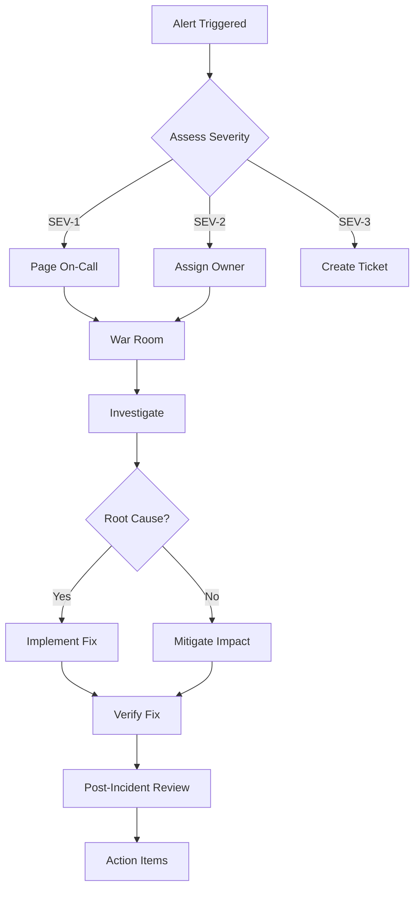

# WeMarket Incident Response Runbook

## Overview

This runbook provides step-by-step procedures for responding to production incidents.

---

## Incident Classification

| Severity | Definition | Response Time | Escalation |
|----------|------------|---------------|------------|
| **SEV-1** | Complete service outage, data loss, security breach | < 15 min | Page on-call immediately |
| **SEV-2** | Major feature degraded, partial outage | < 30 min | Page on-call within 30 min |
| **SEV-3** | Minor issue, workaround exists | < 2 hours | Assign to team |
| **SEV-4** | Low priority, cosmetic | Next business day | Backlog |

---

## Incident Response Flow



---

## SEV-1: Complete Service Outage

### Immediate Actions (0-15 min)

1. **Acknowledge Alert**
   - Acknowledge in PagerDuty/Alertmanager
   - Join incident channel: `#wemarket-incident-<date>`

2. **Initial Assessment**
   ```bash
   # Check overall health
   curl -s https://api.wemarket.com/api/health
   curl -s https://api.wemarket.com/api/health/deep
   
   # Check infrastructure
   kubectl get pods -n wemarket-prod -o wide
   kubectl get nodes
   ```

3. **Establish War Room**
   - Create Slack thread with timestamp
   - Invite: Platform lead, DBA, AI team lead
   - Document timeline in incident doc

4. **Quick Diagnostics**
   ```bash
   # Check if API pods are running
   kubectl get pods -n wemarket-prod -l app=wemarket
   
   # Check ingress
   kubectl get ingress -n wemarket-prod
   
   # Check DNS
   dig api.wemarket.com
   
   # Check CDN
   curl -I https://api.wemarket.com/api/health
   ```

### Investigation Matrix

| Symptom | Likely Cause | Quick Check | Mitigation |
|---------|--------------|-------------|------------|
| All pods CrashLoopBackOff | Config/secret issue | `kubectl logs` | Fix config, rollback |
| Pods Running but 503 | DB/Redis down | Check dependencies | Failover/read replica |
| 502 Bad Gateway | Ingress/pod mismatch | `kubectl get ep` | Restart ingress |
| DNS not resolving | External DNS issue | `dig` / Cloudflare | Check DNS records |
| All pods OOMKilled | Memory leak | `kubectl describe` | Increase limits, restart |

### Deep Investigation (15-60 min)

1. **Check Logs**
   ```bash
   # Recent errors
   kubectl logs -n wemarket-prod -l app=wemarket --tail=500 | grep -i error
   
   # Loki query
   # {job="wemarket-api"} |= "error" | json | level="error"
   ```

2. **Check Metrics**
   - Grafana: WeMarket Overview dashboard
   - Check: CPU, Memory, Disk, Network, DB connections

3. **Check Dependencies**
   ```bash
   # Database
   kubectl exec -it postgres-0 -- pg_isready
   
   # Redis
   kubectl exec -it redis-0 -- redis-cli ping
   
   # External APIs
   curl -s https://generativelanguage.googleapis.com/v1/models
   ```

4. **Recent Changes**
   ```bash
   # Recent deployments
   kubectl rollout history deployment/wemarket -n wemarket-prod
   
   # Recent config changes
   kubectl get events -n wemarket-prod --sort-by='.lastTimestamp' | head -20
   ```

### Resolution

1. **Apply Fix**
   - Config fix: Update ConfigMap/Secret, rollout restart
   - Code fix: Rollback deployment or hotfix deploy
   - Infra fix: Scale up, failover, restart dependencies

2. **Verify Recovery**
   ```bash
   # Health checks
   for i in {1..10}; do curl -s https://api.wemarket.com/api/health; sleep 5; done
   
   # Deep health
   curl https://api.wemarket.com/api/health/deep
   
   # Smoke test
   npm run test:e2e -- --project=smoke
   ```

2. **Monitor**
   - Watch metrics for 30 min
   - Ensure error rate < 0.1%
   - Ensure P99 latency < 2s

---

## SEV-2: Major Feature Degraded

### Examples
- AI recommendations failing (fallback to cached)
- Payment processing slow/failing
- Order creation failing for subset of users
- Real-time updates not working

### Response (0-30 min)

1. **Identify Scope**
   ```bash
   # Which feature?
   # Which users affected?
   # When started?
   
   # Check specific endpoints
   curl -s https://api.wemarket.com/api/ai/tinkerbell-rec \
     -X POST -d '{"store_id":1}' \
     -H "Content-Type: application/json"
   ```

2. **Check Feature-Specific Metrics**
   - Grafana: AI Metrics dashboard
   - Check: AI request rate, error rate, latency, fallback rate

3. **Isolate & Mitigate**
   ```bash
   # If AI failing: Check fallback
   curl -s https://api.wemarket.com/api/health/deep | jq .checks.omniroute
   
   # If payments failing: Check Toss
   curl -s https://api.tosspayments.com/v1/health
   
   # Feature flag to disable
   kubectl patch configmap wemarket-config -n wemarket-prod \
     -p '{"data":{"FEATURE_AI_RECOMMENDATIONS":"false"}}'
   kubectl rollout restart deployment/wemarket -n wemarket-prod
   ```

---

## Database Incidents

### High Connections
```bash
# Check current connections
kubectl exec -it postgres-0 -- psql -U wemarket -c "SELECT count(*) FROM pg_stat_activity;"

# Kill idle connections
kubectl exec -it postgres-0 -- psql -U wemarket -c "
  SELECT pg_terminate_backend(pid) 
  FROM pg_stat_activity 
  WHERE state = 'idle' AND state_change < now() - interval '10 minutes';
"

# Check max connections
kubectl exec -it postgres-0 -- psql -U wemarket -c "SHOW max_connections;"
```

### Slow Queries
```bash
# Find slow queries
kubectl exec -it postgres-0 -- psql -U wemarket -c "
  SELECT query, mean_time, calls, total_time 
  FROM pg_stat_statements 
  ORDER BY mean_time DESC 
  LIMIT 20;
"

# Check for missing indexes
kubectl exec -it postgres-0 -- psql -U wemarket -c "
  SELECT schemaname, tablename, seq_scan, idx_scan 
  FROM pg_stat_user_tables 
  WHERE seq_scan > idx_scan 
  ORDER BY seq_scan DESC;
"
```

### Deadlock
```bash
# Check deadlocks
kubectl exec -it postgres-0 -- psql -U wemarket -c "
  SELECT * FROM pg_stat_database WHERE datname='wemarket';
"

# Check locks
kubectl exec -it postgres-0 -- psql -U wemarket -c "
  SELECT pid, usename, query, state, wait_event_type, wait_event
  FROM pg_stat_activity 
  WHERE wait_event_type = 'Lock';
"
```

### Recovery
```bash
# Point-in-time recovery (Supabase)
# 1. Go to Supabase Dashboard > Database > Backups
# 2. Select "Point-in-time Recovery"
# 3. Choose timestamp before incident
# 4. Confirm restore
```

---

## Redis Incidents

### High Memory
```bash
# Check memory
kubectl exec -it redis-0 -- redis-cli INFO memory

# Check keys
kubectl exec -it redis-0 -- redis-cli --bigkeys

# Flush if needed (CAREFUL!)
kubectl exec -it redis-0 -- redis-cli FLUSHALL
```

### Connection Issues
```bash
# Check connections
kubectl exec -it redis-0 -- redis-cli CLIENT LIST | wc -l

# Check max clients
kubectl exec -it redis-0 -- redis-cli CONFIG GET maxclients

# Restart Redis
kubectl rollout restart statefulset/redis -n wemarket-prod
```

---

## AI Service Incidents

### High Fallback Rate
```bash
# Check OmniRoute health
curl -s http://omniroute:20128/v1/models \
  -H "Authorization: Bearer sk-omniroute"

# Check Gemini quota
# Google Cloud Console > Generative AI > Quotas

# Force fallback disable
kubectl patch configmap wemarket-config -n wemarket-prod \
  -p '{"data":{"FEATURE_AI_FALLBACK":"false"}}'
kubectl rollout restart deployment/wemarket
```

### High Latency
```bash
# Check OmniRoute latency
# Grafana: AI Metrics > Latency

# Check if using cached responses
# Check cache hit rate

# Increase timeout temporarily
kubectl patch configmap wemarket-config -n wemarket-prod \
  -p '{"data":{"AI_TIMEOUT_MS":"30000"}}'
kubectl rollout restart deployment/wemarket
```

### Cost Spike
```bash
# Check usage
# Grafana: AI Metrics > Cost per hour

# Check quota
# Google Cloud Console > Generative AI > Quotas

# Implement rate limiting
kubectl patch configmap wemarket-config -n wemarket-prod \
  -p '{"data":{"RATE_LIMIT_AI_MAX":"30"}}'
kubectl rollout restart deployment/wemarket
```

---

## Post-Incident Process

### 1. Incident Review Meeting (within 48 hours)
- Attendees: Incident commander, involved engineers, stakeholders
- Duration: 30-60 minutes
- Blameless culture

### 2. Incident Report Template
```markdown
# Incident Report: INC-YYYYMMDD-XXX

## Summary
- **Date/Time**: YYYY-MM-DD HH:MM UTC
- **Duration**: XX minutes/hours
- **Severity**: SEV-X
- **Impact**: X% users affected, Y feature(s) degraded

## Timeline
| Time (UTC) | Event |
|------------|-------|
| HH:MM | Alert triggered |
| HH:MM | On-call acknowledged |
| HH:MM | Root cause identified |
| HH:MM | Fix deployed |
| HH:MM | Service restored |

## Root Cause
[Technical explanation of what happened]

## Impact
- Users affected: X%
- Features degraded: [list]
- Revenue impact: $X (if applicable)
- Data loss: Yes/No

## Resolution
[What fixed it]

## Action Items
| Action | Owner | Due Date | Ticket |
|--------|-------|----------|--------|
| Fix root cause | @engineer | YYYY-MM-DD | #123 |
| Add monitoring | @engineer | YYYY-MM-DD | #124 |
| Update runbook | @engineer | YYYY-MM-DD | #125 |

## Lessons Learned
- What went well?
- What could be improved?
- What was lucky?
```

### 3. Action Item Tracking
- Create Jira/GitHub issues for each action item
- Assign owners and due dates
- Review at next team retrospective

---

## Communication Templates

### Internal (Slack)
```
🚨 INCIDENT SEV-1: WeMarket API Down
Started: 2025-01-27 14:32 UTC
Impact: All API endpoints returning 503
Status: Investigating
War Room: #wemarket-incident-20250127
Owner: @oncall-engineer
```

### Customer-Facing (Status Page)
```
WeMarket is currently experiencing degraded performance. Our engineering team is investigating and working on a fix. We apologize for the inconvenience.
```

### Post-Incident (Status Page)
```
The issue has been resolved. WeMarket API is now operating normally. We apologize for the disruption and are taking steps to prevent recurrence.
```

---

## Useful Links

- [Grafana Dashboards](https://grafana.wemarket.com)
- [Loki Logs](https://loki.wemarket.com)
- [ArgoCD](https://argocd.wemarket.com)
- [Supabase Dashboard](https://supabase.com/dashboard)
- [Render Dashboard](https://dashboard.render.com)
- [Cloudflare Dashboard](https://dash.cloudflare.com)
- [PagerDuty](https://wemarket.pagerduty.com)
- [Runbook Repository](https://github.com/kwpark0047-iceu/250105/tree/main/docs/runbooks)

---

*Last Updated: 2025-01-27*  
*Version: 2.0.0*
